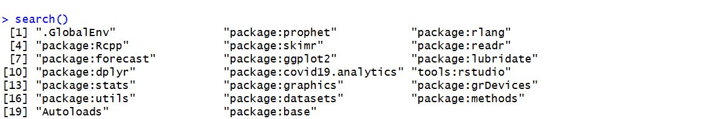
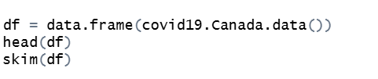

# Forecasting with COVID-19 data using R packages covid19.analytics, forecast, and prophet

This user guide will demonstrate how to attain data from COVID-19 using the `covid19.analytics`

## 1. Open RStudio

If you have not yet installed RStudio or would like to update your version of RStudio, visit the following link: [https://posit.co/downloads/](https://posit.co/downloads/). Create a new R script.

## 2. Install and Load Packages

Install the following packages[^1] if you have not already:

  - `covid19.analytics`
    - for the purposes of this guide, this package will be used to access various data sets about COVID-19
  - `dplyr`
    - dplyr is a R standard for creating data pipelines and transforming data frames to fit the desired format
  - `lubridate`
    - dates often require special packages for processing, such as noting the different possible forms that dates can come in (mm/dd/yyyy, yy/mm/dd, etc.). This belongs under the package `tidyverse`
  - `ggplot2`
    - popular package for data visualization. For exploration of other uses of `ggplot2`, visit this [cheat sheet](https://rstudio.github.io/cheatsheets/data-visualization.pdf), also included in `tidyverse`
  - `forecast`
    - package that brings simple forecasting ability
  - `readr`
    - also belonging underneath `tidyverse`, `readr` allows for easier manipulation of data frames
  - `skimr`
    - package used to skim data frames for basic data exploration and suggestion of the forms of the data used. It gives summary statistics of each column in a data frame
  - `prophet`
    - package that allows for forecasting with more complex trends such as seasonal trends

To install packages, use the function `install.packages()` with the package name in quotation marks. Be sure to comment out this code afterwards so it doesn't repeatedly install the code if you run all of the code at once.

In order to use these packages in your code, add them to the library using `library()`. This will add them to your active session in the order of which you executed the lines of code. To see which packages have been added to the active session and their order, execute the `search()` function without any parameters. You can use this to validate that you have all of the packages listed above.

## 3 Load in Data

In the `covid19.analytics` package, there are a few data sets that can be loaded in and used for easy examples. This user guide will demonstrate forecasting using its Canada data, accessed through `covid19.Canada.data()`

`head(df)` provides the first 6 observations in the data frame `df`.

## 4 Check Date Format

## 5 Transform data

Create a new column in the data set from previous ones

## 6 Forecast New Data

## 7 Plot

For comparison, plot both the forecasted and original data.

## 8 Compare

forecasting between `prophet` and `forecast`

[^1]: Documentation for each package can be found in the CRAN at these links: [covid19.analytics](https://cran.r-project.org/web/packages/covid19.analytics/readme/README.html), [dplyr](https://cran.r-project.org/web/packages/dplyr/readme/README.html), [lubridate](https://rstudio.github.io/cheatsheets/html/lubridate.html), [ggplot2](https://ggplot2.tidyverse.org/), [forecast](https://www.rdocumentation.org/packages/forecast/versions/9.0.1), [readr](https://cran.r-project.org/web/packages/readr/readme/README.html), [skimr](), [prophet]()