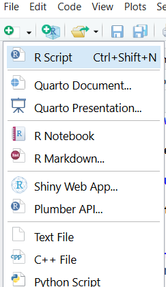

# Forecasting Demonstration using COVID-19 Data

This user guide will demonstrate how to attain data from COVID-19 using the `covid19.analytics` package and 2 methods of forecasting with the `forecast` package (using ARIMA) and the `prophet` package, a procedure used for forecasting created by Facebook. Before applying the concepts of time-series forecasting, here are a few notes and definitions to help in comprehending later steps in this guide:

1. In practicality, "forecasting" and "prediction" are used interchangeably. Forecasting is prediction but with an emphasis on time-series data. 
2. Time series can be dissected into seasonality, level, trend, and noise.
  - **seasonality**: "short-term cyclical behavior" 
  - **level**: "average value of the series" 
  - **trend**: "change in the series from one period to the next" 
  - **noise**: "random variation that results from measurement error or other causes" 
3. These components as seen in (2) can either be multiplicative or additive, which describes the relationship between the components to achieve the response value. 

@shmueliPracticalTimeSeries2024

## Open RStudio

If you have not yet installed RStudio or would like to update your version of RStudio, visit the following link: [https://posit.co/downloads/](https://posit.co/downloads/). Create a new R script.



## Install and Load Packages

Install the following packages[^1] if you have not already:

  - `covid19.analytics`
    - for the purposes of this guide, this package will be used to access various data sets about COVID-19
  - `dplyr`
    - dplyr is a R standard for creating data pipelines and transforming data frames to fit the desired format
  - `lubridate`
    - dates often require special packages for processing, such as noting the different possible forms that dates can come in (mm/dd/yyyy, yy/mm/dd, etc.). This belongs under the package `tidyverse`
  - `ggplot2`
    - popular package for data visualization. For exploration of other uses of `ggplot2`, visit this [cheat sheet](https://rstudio.github.io/cheatsheets/data-visualization.pdf), also included in `tidyverse`
  - `forecast`
    - package that brings simple forecasting ability
  - `readr`
    - also belonging underneath `tidyverse`, `readr` allows for easier manipulation of data frames
  - `skimr`
    - package used to skim data frames for basic data exploration and suggestion of the forms of the data used. It gives summary statistics of each column in a data frame
  - `prophet`
    - package that allows for forecasting created by facebook
  - `tseries`
    - package which will be used for checking assumptions for time series data
    
To install packages, use the function `install.packages()` with the package name in quotation marks. Be sure to comment out this code afterwards so it doesn't repeatedly install the code if you run all of the code at once.
    
```{r}
#| eval: false
library(covid19.analytics)
library(dplyr)
library(ggplot2)
library(forecast)
library(readr)
library(skimr)
library(prophet)
library(tseries)
```

For a quick temperature check on which packages have been added to the active session and their order, execute the `search()` function without any parameters. You can use this to validate that you have all of the packages listed above.

```
 [1] ".GlobalEnv"                "package:tseries"          
 [3] "package:prophet"           "package:rlang"            
 [5] "package:Rcpp"              "package:skimr"            
 [7] "package:readr"             "package:forecast"         
 [9] "package:ggplot2"           "package:lubridate"        
[11] "package:dplyr"             "package:covid19.analytics"
[13] "tools:rstudio"             "package:stats"            
[15] "package:graphics"          "package:grDevices"        
[17] "package:utils"             "package:datasets"         
[19] "package:methods"           "Autoloads"                
[21] "package:base"   
```

## Load in Data

In the `covid19.analytics` package, there are a few data sets that can be loaded in and used for easy examples. This user guide will demonstrate forecasting using its Canada data, accessed through `covid19.Canada.data()`. If you plan to use a different data set, make sure that the data suits the form required for time series analysis. Future sections will explain how to check or obtain the correct format.

`covid19.Canada.data()` is retrieved from [this website](https://health-infobase.canada.ca/covid-19/). We will be using forecasting to predict the number of new cases over time in Ontario, Canada, so the following variables are of importance:

- `prname`
  - The name of the providence that the data is located in
  - type: character
- `totalcases`
  - The number of total cases of COVID-19
  - type: character
- `date`
  - The date that the observations were taken
  - type: character
  
::: callout-note
We will have to do some type casting to assure that the variables are the correct types. The total number of cases should not be listed as character and will need to be changed into numeric.
:::

```{r}
#| eval: false

df = data.frame(covid19.Canada.data())
head(df)
skim(df)
```

`skim(df)` goes variable by variable in `df` and displays the summary statistics depending on the type of variable used. While each variable will show its completeness, a numeric variable will show the mean, standard deviation, and percentile values and a character variable will display the minimum number of characters in the string, the maximum number of characters, the number of unique strings, and a few other features. In the date column of the Canada COVID-19 data frame, there are 0 in `n_missing`, and the `min` and `max` values are both at 10. This would indicate that each row has a value for date and it follows some variation of "dd/mm/yyyy" given each has 10 characters. See the next section on what to do in case the format does not match.

If there is missingness in the data, visit this short [guide](https://www.geeksforgeeks.org/data-science/handling-missing-values-in-time-series-data/) with various options.

## Cleaning the Data

### Date Format

Before being able to work with dates, you must have only one column for the date variable. If your data does not have date in one column and instead spreads out day, month, and year into multiple columns, you can use the `dplyr` package and the following step to combine columns:

```{r}
#| eval: false

df <- df %>% mutate(date=paste(year, month, day, sep = "-"))
```

where `df` is the name of your data frame, `date` is the name of the new column that you are forming, the first three parameters of `paste` are the names of your existing columns of date data, and `sep = "-"` indicates that each field will be separated with a hyphen (@kuruiTidyverseTimeSeries2025). These should be modified to fit your use case.

Next, the package `lubridate` is best for working with dates in R. Once your `date` column properly includes the right content, it is important to ensure that they are in the correct format. For working with time-series data, it is best practice to use `ymd` (year-month-day) format. This format allows the data to be sorted to form chronological order. 

```{r}
#| eval: false

df$date <- ymd(df$date)
```

To explain how this format is best, let's say dates were in the day-month-year format instead. Running a basic sort function would order by whether it is the first, second, third, etc. day of the month, then by what month it is, and then finally by year. The inverse would sort by year first, then month, then day. The end result is a list of date which are in proper chronological order.

Additionally, it makes more logical sense! The first item in a date sequence should be the most important, which is the year. Often, you can tell more about the context of a date given the year than the month or what day of the month it is.

> "Europeans get it wrong. Americans get it wrong. Only computer scientists get it right."
>
> - *Dr. Chris Bourke, my Computing II professor, about date formats*

### Transforming Other Variables 

Create a new data frame as a subset of your previous data frame, selecting only necessary columns. This makes the rest of the steps simpler when there is less information to comb through. The code below is an example of how to use `dplyr` to transform data to a workable state. 

```{r}
#| eval: false

ontario_df <- df %>%
  filter(prname == "Ontario") %>%
  arrange(date) %>%
  mutate(totalcases = parse_number(totalcases, na = c("-", ""))) %>%
  filter(!is.na(totalcases)) %>%
  mutate(new_cases = c(NA, diff(totalcases))) %>%
  filter(!is.na(new_cases)) %>%
  select(date,new_cases)
```

In this example, we are filtering based on the province name "Ontario", which selects all rows in the data frame that belong to Ontario, then sorting by the date. The number of total cases was originally listed as a character variable, so the next few lines such as parsing the number from `totalcases` and filtering out any missing values is necessary. If total cases or whichever variable you would like to analyze does not have this error, you do not need to include parsing. 

Additionally, the question that we are interested in this case is not the total cases, but the number of new cases. To achieve this, a new column was formed, `new_cases`, which was then calculated taking the difference between observations of total cases. Sorting via date is important before this step to guarantee that the `new_cases` shows the difference between the correct dates and not arbitrarily which rows are positioned next to each other.

Lastly, `select()` is used to isolate which columns are being used later during forecasting.

::: callout-note
To check, use `skim()` and `head()` again to ensure that your data is in the correct form and that the transformation did not create any new holes or transformed the data in a way that was not intended. 
:::

## Stationarity

Most statistical methods of forecasting require an exploration of the property **stationarity**, including ARIMA, which will be discussed later. In short, it means that the mean, variance, autocorrelation structure, and others stay constant over time (@StationarityDifferencingTime). There are multiple ways to investigate this in a data set, both informally and formally. In this user guide, we will go over the Augmented Dickey-Fuller Test (ADF). Others can be found [here](https://www.geeksforgeeks.org/r-machine-learning/stationarity-of-time-series-data-using-r/).

### Augmented Dickey-Fuller (ADF) test

The ADF test is a formal test to see if time series data is stationary, where the null hypothesis says the data is non-stationary and the alternative hypothesis says the data is stationary (@mushtaqAugmentedDickeyFuller2011).

```{r}
#| eval: false

adf_test <- adf.test(ontario_df$new_cases)
print("ADF Test:")
print(adf_test)
```
The following output was obtained through running the code:

```
[1] "ADF Test:"

	Augmented Dickey-Fuller Test

data:  ontario_df$new_cases
Dickey-Fuller = -3.9025, Lag order = 6,
p-value = 0.0148
alternative hypothesis: stationary
```

As we can see, the p-value resulting from the test is less than $\alpha = 0.05$, which means that we are 95% confident that we reject the hypothesis that the data is not stationary.

## Forecast New Data

### R Package `forecast`

The demonstration with the `forecast` package will be consistent with what is known as Autoregressive Integrated Moving Average (ARIMA). The `forecast` package is capable of doing other methods of time series forecasting, but we will focus on ARIMA for simplicity's sake.

The first step is to decompose the data. This shows the breakdown of trends by the overall trend, the seasonal shifts, and discerned randomness. This mirrors the components of time-series data (level, trend, seasonality, noise). 

```{r}
#| eval: false

ts_cases <- ts(ontario_df$new_cases, frequency = 24)
d<-decompose(ts_cases, "multiplicative")
plot(d)
d<-decompose(ts_cases, "additive")
plot(d)
```

Looking at these plots, shown in Figures 1 and 2, can provide insight on the structure of your time data. Often, it can show if there is a clear pattern or not. In the case of the COVID-19 data on Ontario, Canada, we can see that there is a lot of randomness with a consistent spike around the halfway mark when a new strain of COVID-19 caused an influx of cases. Revisit the differences between additive and multiplicative components as described at the top of the guide.

::: {layout-ncol=2}
{.lightbox}

{.lightbox}
:::

Lastly, all that is left is to fit the model and forecast. The `auto.arima()` function takes in one vector, which will be the variable that you are trying to predict. Do not pass in your date or time variable. For forecasting, the two parameters are follows:

- object: the object created by the `auto.arima()` function
- h: the number of periods for forecasting (weekly)
- model: which model was used

more parameters for customization can be found in the `forecast` documentation.

```{r}
#| eval: false

fit <- auto.arima(ontario_df$new_cases)
summary(fit)

forecast_8 <- forecast(fit, h = 12, model = "Arima")
forecast_df <- data.frame(forecast_8)
```

### R Package `prophet`

When using `prophet`, it is good to keep in mind that is only for **additive** models, written that the user is able to "get a reasonable forecast on messy data with no manual effort" according to its documentation. True to its statement, there are only three functions required to set up a forecast: `prophet()`, `make_future_dataframe()`, and `predict()`.

- `prophet()` requires a data frame with two columns, `ds` and `y`. The names are required, and the code below shows how to rename a data frame to fit the requirements. Additionally, the rest of the parameters can be toggled, assumed false unless written as true. These are `yearly.seasonality`, `weekly.seasonality`, and `daily.seasonality`.
- `make_future_dataframe()` requires the object created by `prophet()`, the number of periods, and what the periods are. In the example, there will be 12 periods with each period being a week.
- `predict()` requires the outputted objects of the previous functions.

Optional but encouraged: using `select()` to isolate specific columns. The columns selected will be used for plotting in the next section.

```{r}
#| eval: false

prophet_df <- ontario_df %>% 
  rename(ds = date, y = new_cases)

m <- prophet(prophet_df, yearly.seasonality = TRUE)
future <- make_future_dataframe(m, periods = 12, freq = "week")
forecast_p <- predict(m, future)

forecast_p_df <- forecast_p %>% select(ds, yhat, yhat_lower, yhat_upper)
```

## Plot

For comparison, plot both the forecasted and original data. You can copy the following code and change parameters to fit the naming convention of your own code. Both plots include the following:

1. `ggplot()` to initialize the plots being created
2. `geom_ribbon()`, which graphs the bands of confidence around the forecasted data. The parameters of `ymin` and `ymax` differ between the two as the outputs of both forecasting packages are different. `length.out` should match the parameter `h` when used in the function `forecast`. Pay attention to the difference in `x` for both as well.
3. `geom_line()` with the color black is the same for both. This is your original raw data that will be used for visual comparison with the forecasted data.
4. `geom_line()` with the color red is the point forecasted data. Note that the input for `x` should be the same as it is in `geom_ribbon()` for both while `y` reflects the point estimate output of each method.
5. `labs()` are for the axis labels and graph title. Change the strings to fit the description of your data.
6. `theme_minimal()` is for aesthetic purposes only. 

### Code for plotting results from `forecast`
```{r}
#| eval: false

ggplot() +
  geom_ribbon(data = forecast_df,
              aes(x = seq(max(ontario_df$date), by = "week",
                          length.out = 12), ymin = Lo.95, ymax = Hi.95),
              fill = "lightblue", alpha = 0.5) +
  geom_line(data = ontario_df,
            aes(x = date, y = new_cases),
            color = "black") +
  geom_line(data = forecast_df,
            aes(x = seq(max(ontario_df$date),
                        by = "week",
                        length.out = 12),
                y = Point.Forecast),
            color = "red") +
  labs(title = "Ontario Weekly COVID Cases Forecast (forecast)",
       y = "New Cases",
       x = "Date") +
  theme_minimal()
```

### Code for plotting results from `prophet`
```{r}
#| eval: false
ggplot() +
  geom_ribbon(data = forecast_p_df,
              aes(x = ds, ymin = yhat_lower, ymax = yhat_upper),
              fill = "lightblue", alpha = 0.5) +
  geom_line(data = ontario_df,
            aes(x = date, y = new_cases),
            color = "black") +
  geom_line(data = forecast_p_df,
            aes(x = ds, y = yhat),
            color = "red") +
  labs(title = "Ontario Weekly COVID Cases Forecast (prophet)",
       x = "Date", y = "New Cases") +
  theme_minimal()
```

## Compare

### Demonstration

These two plots are examples of ones generated using `forecast` then `prophet`. The largest difference that we can see is the way that each handles new predictions. Figure 4 using `prophet` overlays predictions on top of the current data whereas `forecast` exclusively predicts beyond the current data. This can be manually changed by editing the limits on time for prediction when plotting. In both, the confidence bands in blue showcase that the direction is not conclusive. This could be due to the fact that there are multiple strands of COVID-19 with different transmission rates that have appeared over time, adding more noise to the forecast. Additionally, there are less tests for COVID-19 as vaccines became more widely spread and it was seen as less of a threat as when it first was deemed a global pandemic. Many other external factors could contribute to the near erasure of high inflections in new cases.

Examining `forecast` more, the plot is more realistic simply because the point prediction does not go below zero. The previous trends in seasonality in `prophet` seems to be forced onto the new data, showing that there is going to be negative new cases, which is impossible since the measure of new cases does not take into account active cases. When someone tests positive for COVID-19, they are added to the new cases, but are not checked up on and removed from the count afterwards.

::: {layout-ncol=2}
{.lightbox}

{.lightbox}
:::

### General Guidance

Forecasting is a function of existing data. The more data that exists, the more narrow confidence bands will be. When examining the reliability of forecasting, it is best to be aware of the data that you are working with. The biggest issue seen in the demonstration was the predictions going below zero, which goes against the form of the `new_cases` variable. To explore issues like this, know the bounds of your data and whether or not forecasts break those hard boundaries. Forecasting always comes with the concern that you are extrapolating, therefore the reliability will always be in question as no one knows the future. The further you forecast from the original raw data, the more the reliability will decrease.

[^1]: Documentation for each package can be found in the CRAN at these links: [covid19.analytics](https://cran.r-project.org/web/packages/covid19.analytics/readme/README.html), [dplyr](https://cran.r-project.org/web/packages/dplyr/readme/README.html), [lubridate](https://rstudio.github.io/cheatsheets/html/lubridate.html), [ggplot2](https://ggplot2.tidyverse.org/), [forecast](https://www.rdocumentation.org/packages/forecast/versions/9.0.1), [readr](https://cran.r-project.org/web/packages/readr/readme/README.html), [skimr](https://www.rdocumentation.org/packages/skimr/versions/2.2.2), [prophet](https://facebook.github.io/prophet/), [tseries](https://r-packages.io/packages/tseries)